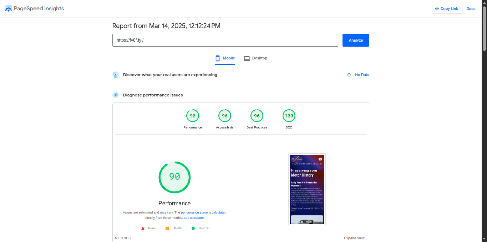

# fordv8foundation.org

Desktop Peformance



---

Desktop Peformance


---

### Change Log: 
March 18,2025
+ Fix Museum Select Motors Article Gallery
+ Move Museum Select Motors List Article in to `custom`
+ Update Content Hub
+ fix all spellings of ```patners``` to ```partners``` ***DONE***
+ Fecth image data from `img/muesum-select-motors` ***DONE***
+ Implement gallery slider on `museum-select-motors` ***DONE***
+ Update decap cms ***DONE***

March 17,2025
+ Fix all `patner` to be `partner`
+ Fetch all gallery museum select motor images `img/musuem-select-motors`
+ Add slider gallery on museum select motors
+ Toggle show hide galleries
+ Update Content CMS

March 16,2025
+ Complete To Do
+ Fix Content Hub

March 15,2025
+ Add Author staff on all Collections
+ Fix Staff Page
+ Update Content Hub

March 14,2025
+ Integration Content Hub
+ Implement Header Anchor
+ Optimazation Lighthouse
+ Fix Pagination on all pages and collections
+ Add purchase button on museum select motots

March 13,2025
+ Finish Import all data
+ Implement Pagefind
+ Implement Widget Museum Select Motors
+ Implement Widget Show All Post for museum select motors
+ Add new Museum Select Motors list and detail page - with per sub such 1930s , 1940s
+ Fix Navbar for support - change from `donate` to be `support` menu + fecth all data from collections
+ Update navbar metadata integration with new fix nav support menu
+ Change About Design
+ Add Donate Button
+ Implement Contact Page
+ Implement Staff Data
+ Implement Staff Data List
+ Implement Membership Print and PDF https://fv8f.fyi/pdf/Membership-App.pdf

March 12,2025
+ Add Nearby Widget on all pages
+ Memorial Fund Change Themes - https://fv8f.fyi//donate/memorial-fund/
+ Brick Campaign Change Themes - https://fv8f.fyi/donate/brick-campaign/
+ Testing Staff Data - not finished yet.
+ Testing Staff Data List - not finished yet.

March 11,2025
+ Add donate collections
+ Add education collections
+ Add video tours collections

March 10,2025
+ Fix Header remove logo
+ Add Link Lists Design & Content
+ Add Thanks Page for redirect form
+ Add membership form
+ Add Group Ticket form
+ Import Content & Image Collections Galleries

March 09,2025
+ Fix URL link for news collections from `new` to be `news`


---
#### TODO

FV8F
Main Menu
1. Change support back to donate - **DONE**
2. Add Museum Select Motors to Menu Bar - **DONE**
    a. Remove collection on fv8f.fyi
    b. Make a button
    c. Link to https://www.museumselectmotors.com/
3. Under about dropdown add J. Windle Event Center contact page. 
    a. J. Windle Event Center Reservation Page
        i. Contact form
            1. Include event type dropdown
            2. Event start date and time
        ii. Photo gallery
4. Collections
    a. Add a dropdown that is Divided by decade like what we did for Museum Motors
    b. Divide collection by decade on /collections/
    c.
5. https://fv8f.fyi/membership-form/
    a. Make spouse optional
    b. Add a question “Do you want to receive the newsletter by email or mail?” then radio buttons: email and mail
    c. Add note they will be directed to payment papge
6. Staff page
    a. Remove kegan
    b. Add email button
7. Homepage.
    a. Make Open Hours stand out more visually. Make the heading pop
8. https://fv8f.fyi/group-ticket-form/ change “Number of Groups” to “Number of people in your group”
    a. Remove state
    b. Remove “request special rate” and change to say our minimum group size is 10 and the group rate is $6.00 a person.


---

#### DONE

1. Create /feed/feed.xml and have it show all recent posts and events - ***DONE***
2. Create /feed/news.xml and have it show all recent posts - ***DONE***
3. Create /feed/events.xml and ahve it show all recent events - ***DONE***
4. In footer after copyright include a lower line that displays as follow "Feeds: [firehose](/feed/feed.xml) | [news](/feed/news.xml) | [events](/feed/events.xml) | [sitemap](sitemap.xml)" - ***DONE***
5. in menubar change News to show as "News & Events" - ***DONE***
6. Make copyright automatically update and display the year ```date: "%Y"``` - ***DONE***
7. on https://fv8f.fyi/events/ add a button under "Museum Select Motors" that takes visitors to: /museum-select-motors/ - ***DONE***
    1. do the same on https://fv8f.fyi/  - ***DONE***
8. add the Ford V8 Foundation logo to /admin/ - ***DONE***
9. Authors
    1. Also can you setup /authors/. Authors in the collection should be John Hoham, Jan Jones, fv8f - ***DONE - use staff content hub integration widget***
    2. Each author page should show all posts and events by that author.  - ***Can't Implement this is a multiauthor concept - the soultions is use tags if you want display post per author***
    3. On posts and events the author name and avatar should appear - ***DONE***
10. Staff
    1. on /staff/ please make sure that the image that is showing here is a 150x150 pixel thumbnail. - ***DONE***
11. in metadata.yaml fix the spelling of ```patners:``` to ```partners:``` - ***DONE***
12. In footer with the social media icons include icon and google maps link https://maps.app.goo.gl/HDNvcBa76x4Nc7R36 and Apple Maps link - ***DONE***
```
https://maps.apple.com/?address=2181%20Rotunda%20Dr,%20Auburn,%20IN%20%2046706,%20United%20States&auid=2400004346339794474&ll=41.334899,-85.089519&lsp=9902&q=Early%20Ford%20V-8%20Foundation%20%26%20Museum&t=m
```
13. on /contact/ also add apple maps link- ***DONE***
14. on /memorial-fund/ line 19 add hyper link to the form.- ***DONE via button***
15. Museum Select Motors Changes- ***DONE***
    1.  import all data and images for 1936 Ford Deluxe Cabriolet add a buy now button. [Buy Now](https://early-ford-v-8-foundation.square.site/product/1936-ford-deluxe-cabriolet/315?cp=true&sa=false&sbp=false&q=false&category_id=20)
    2. import all data and images and add a buy now button for 1932 Ford Tutor Sedan. [Buy Now](https://early-ford-v-8-foundation.square.site/product/1932FordTudorSedan/316?cp=true&sa=false&sbp=false&q=false&category_id=20)
    3. import all data and images and add a buy now button for 1949 Ford Custom Tudor Sedan. [Buy Now](https://early-ford-v-8-foundation.square.site/product/1949-ford-custom-tudor-sedan/283?cp=true&sa=false&sbp=false&q=false&category_id=20)
    4. import all data and images and add a buy now button for 1951 Ford Custom Victoria 1A-60. [Buy Now](https://early-ford-v-8-foundation.square.site/product/1951-ford-custom-victoria-1a-60/314?cp=true&sa=false&sbp=false&q=false&category_id=20)
    5. add photo gallery slider with popup full view to each vechicle. Make this something that can be set via front matter.
16.  Fix Tablet devices / Mobile Landscape Navbar- ***DONE***
+ Import Content Data and Convert design for News Article Page and List [https://fv8f.fyi/news/](https://fv8f.fyi/news/)
+ Import Content Data and Convert design for Event Article Page and List [https://fv8f.fyi/events/](https://fv8f.fyi/events/)
+ Import Content Data and Convert design for Membership Page [https://fv8f.fyi/membership/](https://fv8f.fyi/membership/)
+ Import Content Data and Convert design for About Page [https://fv8f.fyi/about/](https://fv8f.fyi/about/)
+ Import Content Data and Convert design for Patners Page [https://fv8f.fyi/patners/](https://fv8f.fyi/patners/)
+ Import Content Data and Convert design for Nearby Attractions Page [https://fv8f.fyi/nearby-attractions/](https://fv8f.fyi/nearby-attractions/)
+ Implement shop page direct square site [https://fv8f.fyi/shop/](https://fv8f.fyi/shop/)
+ Implement new membership page direct square site [https://fv8f.fyi/new-member/](https://fv8f.fyi/new-member/)
+ Implement short code to custom design german gleser article[https://fv8f.fyi/news/german-glaser/](https://fv8f.fyi/news/german-glaser/)
+ Implement short code to custom design gnery ford article[https://fv8f.fyi/news/henry-ford-was-proud-of-his-Irish-heritage/](https://fv8f.fyi/news/henry-ford-was-proud-of-his-Irish-heritage/)
+ Export Content Data and Convert design for Adopt A Ford Page List & Design [https://fv8f.fyi/adopt-a-ford/](https://fv8f.fyi/adopt-a-ford/)
+ Export Content Data and Convert design for Adopt A Ford Article & Design (11ty Collections) [https://fv8f.fyi/adopt-a-ford/1934-ford-roadster/](https://fv8f.fyi/adopt-a-ford/1934-ford-roadster/)
+ Implement Link Lists Design & Content - https://fv8f.fyi/links/
+ Implement Thanks Page for redirect form - https://fv8f.fyi/thanks/
+ Implement Membership form - https://fv8f.fyi/membership-form/
+ Implement Group Ticket form - https://fv8f.fyi/group-ticket-form/
+ Export Content Collections Galleries - https://fv8f.fyi/collections/
+ Implement Donate List Page https://fv8f.fyi/donate/
+ Implement Donate Article Page https://fv8f.fyi/donate/buy-the-foot/
+ Implement Education List Page https://fv8f.fyi/education/
+ Implement Education Article Page https://fv8f.fyi/education/ipsum/
+ Implement Video Tour List https://fv8f.fyi/tours/
+ Implement Video Tour Article https://fv8f.fyi/tours/lorep
+ Implement Staff List https://fv8f.fyi/staff/
+ Implement Staff Detail https://fv8f.fyi/staff/greg-grim/
+ Implement Contact Page https://fv8f.fyi/contact/
+ Implement Membership Print and PDF https://fv8f.fyi/pdf/Membership-App.pdf
+ Implement Page Find
+ Implement Header Anchor
+ Implement Museum Select Motors https://fv8f.fyi/museum-select-motors/
+ Implement Museum Select Motors Categories https://fv8f.fyi/museum-select-motors/1930/
+ Implement Museum Select Motors Categories Article https://fv8f.fyi/museum-select-motors/1940/1941-Custom-School-Bus/
+ Add purchase button on museum select motots
+ Implement Content Hub

---

### Docs

+ Setings 
    + For website setup
    + Nearby Attractions Page can be update on `_data/metadata.yaml` nearby menu
    + Nav is to config navbar area
    + Nav News ,Events and Donate Nav automatically pulls from collection data
    + Nav museum select motor you can update on `museum_display` area on cms
    + Footer is to update footer area
    + All section can be update on settings cms

+ Home Page to update the home area
+ About Page to update the about page area
+ Home Page to update the home area
+ Adopt Ford Setup to update the Adopt Ford List Page
+ Adopt-A-Ford to update Adopt-A-Ford article
+ Collections Page Setup to update collections main page
+ Collections Gallery to update collections article
+ Contact Page to update contact page
+ Donate Page Setup to config your donate list page
+ Donate Article Pages to update donate collections page article
    - Support with 2 layouts - donate and donate2 , select layout to update your donate page
    - donate layout example https://fv8f.fyi/donate/planned-giving/
    - donate2 layout example https://fv8f.fyi/donate/brick-campaign/
+ Education Page Setup to update education main page
+ Education Posts to create new education post article
+ Event Setup Page to update main event page
+ Events Article to update event article page
+ Museum Select Motor Setup to update Museum Select Motor main page
+ Museum Select Motor 1930 Setup to update 1930
+ Museum Select Motor 1940 Setup to update 1940
+ Museum Select Motor 1950 Setup to update 1950
+ Museum Select Motor others Setup to update others
+ News Setup Pages to update news main page
+ News Article to update news content article
+ Static pages to update your static pages
+ Staff Page Setup to update staff main page
+ Staff to update staff
+ Tours Setup Page to update video tours main page
+ Video Tours to update video toour article
    - To implement video tours you need copy and paste video from youtube embed example `https://www.youtube.com/watch?v=4-g_4pAsqok` just copty id `4-g_4pAsqok`
+ Patner Pages to update main patner page
    - TO create new patners you can access on site settings - patners menu
+ Nearby Attractions to update nearby attractions page
    - To create new you can access on site settings - nearby
+ Links Page to update links page
+ Membership Page to update membership main page
+ Membership Form Page to update membership form
+ Group Ticket Form to update Group Ticket Form
+ Optional New Member Pages - you can use this page if you want - integration with squaresite
+ Optional SHop Page - you can use this page if you want - integration with squaresite
